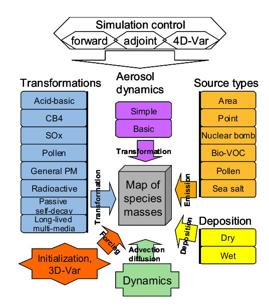

<!--# Silam v5 - User Guide-->

<!--  TOC -->

# 1 Substances and their transformation in SILAM

SILAM is capable of computation of dispersion of up to 496 different nuclides, together with their radioactive decays and transformations; inert and chemically active size-specific aerosol; biological material (pollen grains); chemically active gases. And this is so called the *forward* mode. The model also computes probabilities, where the source represents the measurements of a measurement site and the result is the probability of a certain grid cell to be contributing to that measurement.

<center>


**Fig. 1.** Structure of SILAM.
</center>

The principles implemented in the model enable handling of virtually any species with any types of interactions between them. A single specie or a mixture of species transported in air is called *cocktail*. Each cocktail has specific species and characteristics regarding its composition (see section 3.4.1). The chemical and physical transformations that a cocktail can endure are:

- `PASSIVE`      - used for probability computations, when model is then set in the *backwards* mode.
- `PM_GENERAL`   - no chemical reactions involved; only transport and deposition. Emissions requested: PM
- `DMAT_SULPHUR` - linear chemistry for SO2 and SO4, transport and deposition. Emission requested- SOx
- `ACID_BASIC`   - inorganic chemistry, transport and deposition. Emissions requested: CO, NOx, SOx and NH3
- `CB4`          - inorganic and organic chemistry, transport and deposition. Emissions requested: CO, NMVOC and NOx
- `POP_GENERAL`  -
- `RADIOACTIVE`  - cocktail has inherent radioactive transport and deposition features

# 2 Outline of the initialization/configuration files
SILAM may have up to ten input files depending on the complexity of the setup (see Figure 2).

<!--  -->
```
       control file 
       ├── general_parameters
       │   └──internal model setup
       │      ├── nuclide_database_fnm
       │      ├── chemical_database_fnm
       │      ├── standard_cocktail_fnm
       │      ├── grib_code_table_fnm   
       │      ├── netcdf_name_table_fnm
       │      ├── optical_properties_meta_data_file
       │      ├── photolysis_data_file
       │      └── timezone_list_fnm
       │
       ├── emission_parameters
       │   └── source term file/s
       │
       ├── dispersion_parameters
       │
       ├── meteo_parameters
       │
       ├── transformation_parameters
       │
       ├── initial_and_boundary_conditions
       │   └── boundary_header_filename
       │
       ├── optical_density_parameters
       │
       └── output_parameters
           └── output configuration file


```
**Fig. 2.** Structure of SILAM configuration files.


The mandatory files, for any run configuration, are:

- **control file:** sets the user-defined parameters of the run.
- **source term file:** describes the emission sources, referred from the control file.
- **output configuration file:** description of the output setup, referred from the control file.
- **internal model setup:** referred from the control file, sets the internal model features, usually read-only or fully invisible for users.
  + **standard cocktails file:** defines the standard cocktails that can be used in the source description; referred from the internal setup file. Users are free to create their own cocktails, adding to the existent file;
  + **GRIB or NetCDF code table**: mandatory, invisible for users, referred from the internal setup file.

Depending of the configuration of the run, there are different files that should be included in the setup configuration:

- **nuclide data file:** for radioactive simulations, invisible for users, referred from the internal setup file;
- **nuclide decay data file:** for radioactive simulations, invisible for users, referred from the internal setup file;
- **land-use data:** for chemical simulations of biogenic emissions, invisible for users, referred from the internal setup file;
- **optical properties:** for chemical and aerosol simulation, describes the optical properties of substances, invisible for users, referred from the internal setup file;
- **chemical properties:** describes the chemical properties of the species available in SILAM, invisible for users, referred from the internal setup file;

> **Do NOT alter internal model files referred from the internal setup file**; their modification may lead the model to malfunction. Only the source terms, the control file, the output configuration file, boundary file and the standard cocktails file are open to everyone. 

The structure of the mandatory files will be described in this document. Nuclide data file, nuclide decay file, chemical and optical properties files, land use data and GRIB/NetCDF code table files must **NOT** be altered by the user in any circumstances, and therefore are not included in the document.


# 3 Configuration files
## 3.1 General rules for the configuration files:
- All configuration files are ASCII files following one of the two standard formats: fixed-structure file or namelist-type file. Output configuration and internal files follow the fixed-structure format, and control and source files are following the namelist-type format.
- Each file consists of a set of lines, with leading and trailing blanks ignored.
- Lines are case-sensitive.
- Empty lines and commented lines are ignored. All characters after signs `#` or `!` are considered as comments. <!--Note: sign `#` always starts comments, while sign `!` starts comments ONLY if it is placed at the beginning of line or preceded by the empty space.-->
- Path and names of files are written in a usual format `<full_path><file_name>`, where both `<path>` and `<name>` can vary depending on their content. In case of including templates (commonly recognized by having `%` character):

> Example: `/data/hirfields/fc%ay4%am2%ad2%ah2%f2, `/data/hirfields/` is the path to the files and `%ay4%am2%ad2%ah2%f2` is file name itself. The name depends on the analysis time and forecast length of the fields stored in it.

Templates pointing to the analysis time (not allowed for the output files):

| format  | description | example |
|---------|------------------------------------------------|---------|
| `%ay4`  | 4-digit year of the analysis time              |  *2002* |
| `%am2`  | 2-digit month of the analysis time             |  *01*   | 
| `%ad2%` | 2-digit day of the analysis time               |  *05*   |
| `%ah2`  | 2-digit hour of the analysis time              |  *07*   |
| `%f2`   | 2-digit number of hours of the forecast length |  *015*  |

**More about templates:**

Analysis time, Forecast base time or first guess verification time (all usually at synoptic hours: 00, 06, 12 and 18). Templates pointing to the analysis time:

| format  | description | example |
|------------------------|----------------------------------------------------------------------|---------------------|
| `%ay2`, `%ay4`         | firmly 2- and 4-digit year of the analysis time                      | *02* or *2002*      |
| `%am1`, `%am2`, `%amc` | 1 or 2-digit; firmly 2-digit; 3-character month of the analysis time | *1*; *01* or *JAN*  |
| `%ad1`, `%ad2%`        | 1 or 2-digit; firmly2-digit day of the analysis time                 | *5*; *05*           |
| `%ah1`, `%ah2`, `%ah3` | 1,2 or 3; 2 or 3; firmly 3-digit hour of the analysis time           | *7*; *07*; *007*    |
| `%an2`,                | 2-digit minutes of the analysis time                                 | *15*                |
| `%f2 `, `%f3`          | 2- and 3-digit number of hours of the forecast length                | *15*; *015*         |

Observation time (any combination in hours and minutes is valid, subject to data
availability in the archive). Templates pointing to the valid time of the fields are
constructed in the same way but without the *a*, e.g. %y2; %y4 – firmly 2- and 4-digit
year of the analysis time (e.g. *02* or *2002*)


## 3.2 Rules for the namelist-type format:

- A single file includes a group of namelists, placed one-by-one in arbitrary order.
- A single namelist starts from the line `LIST = <namelist_name>` and ends with the line `END_LIST = <namelist_name>`, the blank spaces around the `=` character are mandatory. The `namelist_name` must be understood by the model.
- The namelist content is placed between the LIST – END_LIST lines with the following format: <item_name> = <item_value>, the blank spaces around the `=` character are mandatory. The item_name must be understood by the model and the item_value format and meaning fully depends on the item_name. The item_value may vary from a single number to a complicated line with several space-separated fields.
- The order of the namelist lines is arbitrary and unnecessary lines or lines with unknown
item_name will be skipped by the model.

## 3.3 Control file
The control file is the main configuration file, where the model set-up is described. This file
will also provide the link between the model and other necessary input files. A control file is
always starting and ending with `CONTROL_V5` and `END_CONTROL_V5`. A control file is a namelist
 group that contains eight namelists:

- `general_parameters		   `
- `emission_parameters		   `
- `dispersion_parameters	   `
- `meteo_parameters		   `
- `transformation_parameters	   `
- `initial_and_boundary_conditions `
- `optical_density_parameters	   `
- `output_parameters		   `

that start and end respectively by `LIST = <namelist>` and `END_LIST = <namelist>`.
 The model will only read what is stated between these two command lines. 

Below sections describe the `item_names` for each namelist.

### 3.3.1 `GENERAL_PARAMETERS`

Here we set the name of the run, dates, time step, and type of run:
```
LIST = general_parameters
   case_name    = prueba
   system_setup = /home/rama/SILAM/ini/standard_eulerian.setup 
   direction_in_time = FORWARD           ! [ FORWARD/INVERSE ]
   start_time   = 2009 03 15 19 00 00
   end_time     = 2009 03 16 18 00 00
   time_step    = 60                     ! [minutos]
   !computed_period = 23 hour
   !nbr_of_out_trajectories = 0          !solo si es lagrangiano.
   !progress_file_name =                 !archivo para debugging
   !computation_accuracy =
END_LIST = general_parameters
```

| variable               | description                   | format / value      |
|------------------------|-------------------------------|---------------------|
| `case_name`    	 | name of the run		 | `%s`                |
| `system_setup` 	 | path to standard setup file   | `%s`                |
| `direction_in_time`    | direction in time of the run. | `FORWARD`/`INVERSE` |
| `start_time`         	 | -                             | `%Y %m %d %H %M %s` |
| `end_time`             | -                             | `%Y %m %d %H %M %s` |
| `computed_period`      | -                             | `%d (hr/day/mon/yr)`|
| `time_step`            | number of minutes (min)       | `%d min`            |
| `computation_accuracy` | [0..10]                       | `%d`	               |


### 3.3.2 `EMISSION_PARAMETERS`

```
LIST = emission_parameters

  emission_source = EULERIAN  emis/dust-simple/src_simple_dust.ini
  cut_area_source_if_outside_meteo_grid = YES
  if_technical_source_dump = NONE


END_LIST = emission_parameters
```

| variable                                | description             | format / value      |
|-----------------------------------------|-------------------------|---------------------|
| `emission_source`                       | type of source and path | <type>  <path>      |
| `cut_area_source_if_outside_meteo_grid` |                         | `YES`/`NO`          |

The type of source and file depends if the emissions are computed by SILAM or not. SILAM’s
state-of-the-art is that natural PM emissions, such as sea salt (SEA_SALT), pollen
(POLLEN), biogenic volatile organic compounds - VOC (BIOGENIC_VOC) and dust 
(DESERT_DUST) are computed by the model.
 When these types of sources are stated, the model request specific initialization files found in the silam_v5_0/ini directory (see section 3.6).
Wild land fires source are currently obtained by the Fire Assimilation System at the Finnish Meteorological Institute (FMI) and has specific physical and chemical information for this type of emissions. Therefore, if using FMI wild-land fire emissions, WILD_LAND_FIRE should be
the type to be stated.


### 3.3.3 `DISPERSION_PARAMETERS`

Mainly grid definitions and configuration.

```
LIST = dispersion_parameters


END_LIST = dispersion_parameters
```

All geographical values are in degrees and decimal parts of a degree, NO MINUTES/SECONDS.

- `grid_type` = `lon_lat`         Geographical coordinates grid is so far the only available
- `grid_title`.                   A name for the grid.
- `lon_start` and `lat_start`     Area source’s longitude and latitude of the first grid cell -ksec2(5), ksec2(4).
- `dx` and `dy`                   x- and y-direction increment (lon and lat) - ksec2(9), ksec2(10).10
- `nx` and `ny`                   Number of cells along the parallel ksec2(3), ksec2(2)
- `lon_end` and`lat_end`         Area source’s longitude and latitude of the last grid cell (ksec2(8), ksec2(7)). Not needed if nx and ny are defined. and meridian (varying lon and lat) - `dx`, `lon_start` are defined
- `lat_s_pole`                   Latitude of the south pole of rotation (-90. for geo) - ksec2(13)
- `lon_s_pole`                   Longitude of the south pole of rotation (0. for geo) - ksec2(14)
- `lat_pole_stretch`             Latitude of pole of stretching (0 so far) - ksec2(15)
- `lon_pole_stretch`             Longitude of pole of stretching (0 so far) - ksec2(16)
- `resol_flag`                   Resolution flag. DEFAULT: 128 = regular grid - ksec2(6),
- `ifReduced`                    Regular/reduced grid flag. DEFAULT: 0=regular - ksec2(17),
- `earth_flag`                   Earth-flag, 0=sphere, 64=oblate spheroid. DEFAULT: 0 - ksec2(18),
- `wind_component`               Wind flag, 0=u,v relate to east/north, 8=u,v relate to x/y growing - ksec2(19),
- `reduced_nbr_str`              Number of elements along the reduced direction, in one line - ksec2(23+)
- `vertical_method`              `OUPUT_LEVELS`/`METEO_LEVELS`/`CUSTOM_LEVELS`.

If `OUTPUT_LEVELS` it assumes the same vertical levels defined for the output.
If `METEO_LEVELS`  it assumes the same vertical level as the meteorological files
If `CUSTOM_LEVELS` the user has to set the levels by defining the following namelists:

- `level_type` = `HEIGHT_FROM_SURFACE` / `ALTITUDE_FROM_SEA` / `PRESSURE` / `HYBRID`. There are 3 types of the output vertical allowed: z-, p- and hybrid systems, with corresponding units as: metres, hectoPascals or hybrid relative numbers. If the hybrid layers are selected, they MUST exist in the meteodata. The difference between the levels and layers is that levels are defined at one altitude, while layers cover the whole range between two levels. Dispersion output must be made into layers, while meteorology makes sense at levels too. Rules: z-, p- systems accept both THICKNESS of the layers and their CENTRAL POINTS; hybrid system accepts the NUMBER of the meteo hybrid and model will get the central point.
- `layer_thickness` = Thickness of the output levels in [m]/[pa]/[hybrid_nbr] depending on the level type.

### 3.3.4 `METEO_PARAMETERS`

Paths to meteorological data.

```
LIST = meteo_parameters


END_LIST = meteo_parameters
```

- `dynamic_meteo_file` = <file type> <file name>. File type: GRIB / ASCII / NETCDF and is
time dependent. The filename format is described in section 3.1.
- `static_meteo_file` = <file type> <file name>. If `static_meteo_file = -`, the dynamic file is used. These files are not varying in time.
- `meteo_time_step`. Weather data time interval: number and unit, integer > 0
- `if_wait_for_data` = YES/NO, if yes, model will waits for the missing meteorological files.
- `abl_parameterization_method` = `DRY_ABL/FULL_PARAM`. Sets the methodology for the boundary layer height computation. The methods available for the computation are `DRY_ABL` and `FULL_PARAM`. `DRY_ABL` parameterization is computing atmospheric boundary layer without humidity correction and `FULL_PARAM` includes humidity correction. `DRY_ABL` is the common used method.
- `number_of_precipitation_fields` = 1/ 2. If only large-scale rain is required and available the user should use 1; if both convective and large-scale rain required and available the user should use 2. Typically both fields are required.


### 3.3.5 `TRANSFORMATION_PARAMETERS`

```
LIST = transformation_parameters
  transformation = CB5_SOA EULERIAN
  aerosol_dynamics = SIMPLE  EULERIAN
  dry_deposition_scheme = KS2011_TF
  surface_resistance_method = WES2013
  wet_deposition_scheme = 2018_SCAVENGING
  max_scav_rate_depends_on = CAPE
  use_dynamic_albedo = YES
  if_actual_humidity_for_particle_size = YES
  default_relative_humidity = 0.8
  passive_subst_ref_lifetime = 1000000 day
  passive_subst_ref_tempr = 288
  passive_subst_dLifeTime_dT = 0 min/K
  passive_ones_tracer = NO
  mass_low_threshold = STANDARD_ACCURACY
  oh_param_method = FROM_MASSMAP
  biogenic_SOA_aging_rate = 1.2E-11
  anthropogenic_SOA_aging_rate = 4.0E-11
  intermediate_volatility_OC_aging_rate = 4.0E-11
  if_monoterpene_products = 1.0
  if_full_acid_chemistry = YES
  make_coarse_no3 = sslt   0.03
  methylchloroform_OH_rate_factor = 1.0
  photolysis_affected_by_o3col = YES
  photolysis_affected_by_aod = YES
  photolysis_AOD_wavelength = 550 nm
  cloud_model_for_photolysis = SIMPLE_CLOUD
  cbm_tolerance = FAST
END_LIST = transformation_parameters
```


- `transformation` = `PASSIVE / PM_GENERAL / DMAT_SULPHUR / CB4 / POP_GENERAL / ACID BASIC`, sets the chemical and physical processes undergoing during the computation, depending on the emissions available (see section 1). Notice that several can be co-existing except the chemical transformations 
- `aerosol_dynamics` = `SIMPLE`, sets the methodology for including aerosol dynamics processes.
- `dry_depostion_scheme` = `GRAVITATIONAL_AND_FULL_DIFFUSION/ GRAVITATIONAL_ONLY/SIMPLE_DIFFUSION_ONLY/FULL_DIFFUSION_ONLY/GRAVITATIONAL_AND_SIMPLE_DIFFUSION/`. Sets the method for the dry deposition and includes gravitational settling or/and diffusion. SIMPLE_DIFFUSION_ONLY is only considering viscous sub-layer resistance. `GRAVITATIONAL_AND_FULL_DIFFUSION` is typically used.
- `wet_depostion_scheme` = `STANDARD_3D_SCAVENGING`. The only wet deposition method available. 
- `if_actual_humidity_for_particle_size` = `YES/NO`. Sets if humidity is time resolving or not.
- `default_relative_humidity`. Sets the default value for relative humidity, with typically number of 0.8.
- `compute_thermodiffusion` = `YES/NO`. Sets if the model computes thermodiffusion or not. Normally set to NO.
- `mass_low_threshold` = `CRUDE_ACCURACY / STANDARD_ACCURACY / HIGH_ACCURACY`. Sets the accuracy for the computation of the low-mass threshold for the Eulerian setup. Normally set to `HIGH_ACCURACY`.
- `if_full_acid_chemistry` = YES/NO. Sets if nitrogen chemistry is computed or not; method to compute biogenic VOC emissions (only for transformations `ACID_BASIC` and `CB4`). Normally set as YES.
- `passive_subst_ref_lifetime`,`passive_subst_ref_tempr`,`passive_subst_dLifeTime_dT` are setting different parameters for the run with a passive tracer: lifetime, temperature and degradation with temperature. If PASSIVE transformation is not set, then these values are irrelevant. Typical values are shown in Figure 7.
- `ADB_if_compute_nucleation`,`ADb_nucleation_scheme`,`ADB_if_compute_coagulation`,`ADB_if_compute_condensation`,`ADB_if_compute_cloud_activation`, `ADB_if_compute_recalcu_wet_d` are set if aerosol dynamics is taken into account. Figure 7 is showing the standard setting if aerosol dynamics is requested.

### 3.3.6 `INITIAL_AND_BOUNDARY_CONDITIONS`

```
LIST = initial_and_boundary_conditions
  initialize_quantity = concentration
  initialize_quantity = advection_moment_x
  initialize_quantity = advection_moment_y
  initialize_quantity = advection_moment_z
  initialization_file = GRADS    ${OUTPUT_DIR}/%ay4%am2%ad2/%y4%m2%d2%h2_%y4_%m2_%d2_%h2.00.0.0_dump.grads.super_ctl

  boundary_type = DIRICHLET
  if_lateral_boundary = YES
  if_top_boundary = YES
  if_bottom_boundary = NO
  boundary_time_step = 3 hr
  boundary_header_filename = boundary_CB5_globalCB4.ini

END LIST = initial_and_boundary_conditions
```

For initializing a run the user can set:

- `initialize_quantity`. Describes which quantity is being initialized. The typical case is concentration.
- `initialization_file` = <file type> <file name>. The file type can be GRIB, GRADS and POINT_DATA. If GRADS type the file to be used is a super ctl file. This file is the standard output of any SILAM run.


For setting boundary conditions:

- `boundary_type` = ZERO/DIRICHLET. Boundaries can be static (ZERO) or timeresolving (DIRICHLET) 
- `if_lateral_boundary` = YES/NO. If lateral boundary is or not set to the values prescribed in the boundaries file.
- `if_top_boundary` = YES/NO. If top boundary is or not set to the values prescribed in the boundaries file 
- `if_bottom_boundary` = YES/NO. If bottom boundary is or not set to the values prescribed in the boundaries file 
- `boundary_time_step` = <timestep> <unit> 
- `boundary_header_filename`. Filename of the file describing the concentrations at the boundaries. The boundary file itself maps input data concentration for boundaries and transport species. See section 3.6 for the description of boundary header file.


### 3.3.7 `OPTICAL_DENSITY_PARAMETERS`

```
LIST = optical_density_parameters
  optical_coefficients_depend_on_relative_humidity = YES
  optical_coefficients_depend_on_temperature = YES
  if_split_aerosol_modes = YES
  if_narrow_wave_bands = YES
END_LIST = optical_density_parameters
```

This namelist describes the parameters needed for the optical density calculation:

- optical_coefficients_depend_on_relative_humidity = YES/NO dependency the optical properties on relative humidity
- optical_coefficients_depend_on_temperature = YES/NO dependency the optical properties on temperature
- if_split_aerosol_modes not working yet
- if_narrow_wave_bands not working yet


### 3.3.8 `OUTPUT_PARAMETERS`

```
LIST = output_parameters


END_LIST = output_parameters 
```

- `source_id` = ` NO_SOURCE_SPLIT / SOURCE_NAME / SOURCE_SECTOR / SOURCE_NAME_AND_SECTOR`. Controls mixing or splitting of the plumes from individual sources in the output files. In case of MIX_SOURCES, the plumes are mixed, so that all the sources create a single output field or trajectory set. If sources are split – each plume from the corresponding source is put into its own file, thus creating a surrogate for the source-receptor matrix computations. The source may have name and sector – and they both can be used for the creation of the source ID (NO_SOURCE_SPLIT) or according to source name and/or sector.

- `vertical_method`, `level_type` and `layer_thickness` are explained in section 3.3.3
- `output_time_step`. Output timestep and unit
- `output_times` = `REGULAR` (standard)
- `file_type` = `GRIB_YES/NO TRAJECTORY_YES/NO GRADS_YES/NO ENSEMBLE_YES/NO NETCDF_YES/NO`. This namelist defines the type of output file 16required, by setting the type of output to YES or NO. The type of output can be GRIB, GRADS, NETCDF and ensemble for Eulerian setup and trajectories for Lagragian setup. 
- `time_split` = A`LL_IN_ONE / HOURLY_NEW_FILE / DAILY_NEW_FILE / MONTHLY_NEW_FILE/ YEARLY_NEW_FILE`, depending of how the user wants these files to be stored, bearing in mind that this is just to store since the ouput averaging is set by `output_time_step`.
- `template`. <Path for output dumping>\%case\%case_%y4%m2%d2%h2 time template depends on the `time_split` chosen
- `variable_list`. Path for output_config file.
- `grid_method` = `EMIS_GRID / METEO_GRID / AREA_BASED / CUSTOM_GRID`. Grid definition for the output files. The same definition as emission or meteorological files (EMIS or METEO_GRID) or according to specific needs. If AREA_BASED, the output area and required resolution have to be defined:
- `area_borders` = <south> <north> <west> <east>; North positive, east positive; all real.
- `area_title`. A name for the area defined
- `resolution`. Horizontal grid size of output grid, [km]/[m]/[deg], real

If CUSTOM_GRID, a full definition of the grid has to be described, see section 3.3.3.


## 3.4 Source term files 

The source file for SILAM consists of a list of individual sources, following one-by-one.
Each source is treated totally independently from the others. The source is always started
from the Header line and ends by End line. There are three types of sources supported:
bomb source, point source and area source. They all can appear in the same emission file.
In SILAM there is no limitation on the type of emitted species, except if the species are
chemically active, where there can be only one type of chemistry involved: sulphate
chemistry (DMAT_SULPHUR), inorganic chemistry (ACID_BASIC) or inorganic and organic
chemistry (CB4).

### 3.4.1 Point source v.5

This source term is compatible for forward and backward runs. The source file may contain
several sources of this type, as well other types, as long as each source is defined by
starting and ending with: PONIT_SOURCE_5 and END_POINT_SOURCE_5, these lines are
mandatory!!.
17Figure 10. SILAM’s point source file
•
source_name. Source name. The source name has to be different if there are other
sources.
•
source_sector_name. Normally according to EMEP’s sector denomination. May be
empty.
•
source_longitude. Source’s geographical longitude, degrees and decimals, N positive,
E positive.
•
source_latitude. Source geographical latitude, degrees and decimals, N positive, E
positive.
•
plume_rise = PLUME_RISE_YES / PLUME_RISE_NO. Activates the buoyant plume
rise routine
•
release_rate_unit = <mass>/<time> (no spaces!!):
18- mass: kg][g][t][Bq][mole][number]
- time: [yr][mon][day][hr][min][sec]
• vertical_unit. Unit of the vertical release boundaries [hpa] or [m]
• par_str is the time definition of the source
if time of release is fixed-in-time source, fixed-in-time release is defined via two lines with
identical parameters and with start and end time of the release. The source is activated at
current moment (“NOW”) or at last-most meteorological time (“LAST_METEO_TIME”) and
will continue constant-in-time release during the given duration.
•
par_str =
[NOW]/[LAST_METEO_TIME] <duration [min]> <rate> <xy_size>
<bottom> <top> <z-velocity> <tempr> <cocktail_name>
•
par_str =
[NOW]/[LAST_METEO_TIME] <duration [min]> <rate> <xy_size>
<bottom> <top> <z-velocity> <tempr> <cocktail_name>
if time of release is varying source, the first line determines the start of the release and last
line determines the end of the release. There are an arbitrary number of lines and if two
sequential lines have different release parameters, every parameter will be linearly
interpolated between these times. A varying source is defined by a 4-digit year and a 2-digit
month, day, hour and minute, seconds is a real value with mandatory decimal dot.
•
par_str = <year> <month> <day> <hour> <minute> <sec> <rate> <xy_size> <bottom>
<top> <z-velocity> <tempr> <cocktail_name>
•
par_str = <year> <month> <day> <hour> <minute> <sec> <rate> <xy_size> <bottom>
<top> <z-velocity> <tempr> <cocktail_name>
The release rate (<rate>) is the value of the release in the units defined by release_rate_unit
(above). The horizontal size (<xy_size>) is the diameter of the source since sources are
assumed to be circles. Bottom and top are the vertical boundaries of the emitted cloud (unit:
meters or hPa). If the plume-rise routine is activated, the boundaries must be the same and
correspond to physical height of the source. The vertical velocity (z-velocity) is the velocity of
the plume at the top of stack (unit: meters per second). Temperature at the top of the stack of
outgoing gases is defined by (tempr). The release composition (cocktail_name) points to one
of the standard cocktails.
• hour_in_day_index. Diurnal relative intensity considering 24 hours in day.
• day_in_week_index. Week-day relative intensity considering 7 days in a week.
• month_in_year_index. Monthly relative intensity considering 12 months in a year.


### 3.4.2 Area source v.3

This form represents a SILAM source term type: a spatially distributed emission source.
Following the general standards, it is defined in some 3-dimensional grid, while the time
dimension is represented in a very similar way as par_str in the above point sources. Grid
and vertical definitions follow the standards of the GRID format. The source file consists of
five main parts: general parameters, grid definition, vertical definition, time definitions and
grid cell values. A template of the file is below and the namelists are described. The source
file may contain several sources of this type, as well other types, as long as each source is
defined by starting and ending with: AREA_SOURCE_3 and END_AREA_SOURCE_3

There are a few critical differences between the above area source definition and the point
source files. They all originate from one more dimension of parameter variations – spatial –
that has to be taken into account. In the point source definition, there is only one vertical
layer where the emission goes to. All sophisticated considerations are supposed to be solved
via a plume rise routine. Such approach does not work with the area sources. Therefore,
there are two ways allowed for the description of the vertical distribution: time-varying single
layer defined in par_str for corresponding times (resembling the approach of point sources),
and multi-layer distribution that is fixed in time but allows split of emission between the layers
(see vertical_distribution and vertical_layer in the above example).
Another ambiguity is connected with the composition of the release. Species mass fractions
in cocktail may vary between the grid cells. To take this into account, another two-option
21selection is introduced (switcher is the cocktail_composition line). The first option is the same
as in point source: the cocktail name is taken from par_str, its composition is taken from the
cocktail description file (section 3.8) and assumed the same for all grid cells.
Time variation of the composition is then reproduced via cocktail definition – as is done in the
point source. The second option is to use fixed-in-time but varying-in-space cocktail
composition. In this case, the cocktail name in the par_str lines defines only lists of species
and aerosol size classes, while the mass fractions are written in the val lines – specifically for
each grid cell. In the latter case, there must be an agreement between the number of mass
fractions in the val lines and the number of species in the cocktail descriptors references in
the par_str lines.
It is also possible to create sources with dynamical emission rates computed with regard to
meteorological parameters, which is mandatory for biogenic emission. This is the case of,
e.g., sea salt, as explained in the following section.

### 3.4.3 Sea salt initialisation file
The emission map of sea salt is computed internally by the SILAM model. This type of
source is so called a map source, where the emission map is created by utilising GIS data
and source functions. In the case of the sea salt the GIS data is a, a map for the salinity
distribution and the source function is dependent of sea surface temperature and salinity.
The source contain the aerosol distribution of the substance emitted as well as other
parameters describing the sea salt aerosol. The example shown below is a standard file,
where the user just needs to change the path of the source_mask_area. This file is provided
within SILAM package.


## 3.5 Output configuration file

The output post-processor allows the user to select flexible averaging for each dispersion
variable and to include any SILAM internal meteorological variable to the output. The output
variable categories are:
• general characteristics of the output variables
• dispersion
• meteorological
• nuclides
The output configuration file should be starting and ending with OUT_CONFIG_3_7 and
END_OUT_CONFIG_3_7. These lines mandatory!! This file has a single namelist that should
be started and ended by: LIST = OUT_CONFIG_3_7 and END_LIST = OUT_CONFIG_3_7.
The content between the namelist defines the output available


The general characteristics of the output variables category basically describes how to
report the aerosol sizes: as one size (SUM) or different sizes, as described in the cocktail
description (SEPARATE), see section 3.8.
•
aerosol_size_mode = SEPARATE/SUM
24The remaining categories have arbitrary number of lines containing three or four or five fields
(see Figure 13), depending of the output variable category requested. The general format
goes:
•
out_var = <necessity_index> <variable_name> <substance_name/lists> <averaging>
with optical properties:
•
out_var = <necessity_index> <variable_name> <substance_name/lists> <averaging>
<wave_lenght>
with meteorological variables:
•
out_var = <necessity_index> <variable_name> <averaging>
To request or not a variable, there is a necessity index that is placed after the out_var item
list:
• 0 – quantity is not needed
• 1 – quantity is desirable, but if is not available the model run will not be discontinued
•
2 – mandatory variable for the output, if the variable is not available, the model run will
be interrupted.
The variable name is fixed by the model, and the user just has to use the necessity index
to switch on or off that variable output request.
The substance name/lists is set according to the availability of substances and the user
necessity. If the run is not for an individual substance, there can be requested:
• SOURCE_INVENTORY, just the substances emitted.
• FULL_INVENTORY when requested all the substances present in the dispersion cloud.
The averaging type for the particular variable is set by the user according to the user’s
needs. The available types of averaging are:
•
AS_IS – the field comes to the output exactly as it was stored in SILAM internal buffers at
the moment of output collection
•
INSTANT – cumulative field is converted to their mean rates between the last two model
time steps, while the instant variables go as they are
• CUMULATIVE – the variable is accumulated since the beginning of the simulations
• AVERAGE – the variable is averaged from the previous to the current output time
• MEAN_LAST_**_HR – the field is averaged over the given period preceding the current
output. The period must not be longer than the interval between the outputs.
25The wavelength (units: nm) is set by the user. The optical properties of the substance
name/list are set for this specific wavelength.

## 3.6 Boundary header file

The boundary header file describes the information about the boundary fields to be used by
the model; the user should edit this file accordingly. The figure below shows an example of a
boundary header file. This file does not need a beginning and end namelist.
Figure 14. SILAM’s boundary conditions header file
• boundary_file = <file path and file name>
• file_format = GRIB/ASCII/GRADS/NETCDF. Format of the input files
• boundary_names = NSEWTB. Description of which boundaries of the domain are
emitting: N = north, S = south, E = east, W = west, T = top and B = bottom. the example
here is for the case that all the boundaries are emitting.
•
ifClimatology = YES/NO, is the time resolution of the boundaries is climatological or
not.
•
climatologyTimestep = MONTHLY/STATIC this item will only be used ifClimatology =
YES, and varies if the files are time dependent (MONTHLY) or not (STATIC).
•
nBoundSpecies = <nro of species>, number of species to be read from the boundary
files.
•
par_str
=
<boundary_substance_name>
<model_substance_name>
<boundary_substance_mode> <model_substance_mode> <conversion_factor>
The same substance might have different name in the boundary fields and in the model,
therefore it is necessary to define the name of the substances required, as well as their
mode. In case of gases the mode is zero. the conversion factor might be necessary if the
user finds it more suitable to convert the emissions to a, e.g. SI unit.
26

## 3.7 Internal model setup

The internal setup file is the file that provides other configuration files that are needed for running SILAM model. This file is only open for user to write the correct path for the files mentioned in this file, see Figure 15. These files are included in SILAM package and are essential for the model to run.


## 3.8 Standard cocktails

Cocktail description files contain lists of cocktails. Cocktail description consists of the cocktail name, type, unit of fractions and then a list of species with their fractions (in corresponding unit) in the cocktail.
The description starts from header and ends with end line: `COCKTAIL_DESCRIPTION_V3_2` and `END_COCKTAIL_DESCRIPTION_V3_2`. The cocktail may contain the gas and/or aerosol description. Standard cocktails can be used by their names in the source term files. An example of cocktail description is given in Figure 16. Depending on whether the aerosol size classes are defined, the fractions have somewhat different meaning. A total mass fraction of each substance in the mixture comes as a sum of fractions of the substance in the aerosol classes and/or gas phase.

- `cocktail_name`= random name
- `mass_unit`    = Bq/number/mass
- `gas_phase`    = YES/NO
- `aerosol_mode` = <min> <max> <average diameter> <diameter_unit> <density> <density_unit>
- `aerosol_distribution_shape` = `FIXED_DIAMETER` (so far the only available).
- `component_fraction` = <Component name> <mass fraction in the mixture>, there should be as many `component_fraction` lines as the number of substances that the user is trying to simulate. Only substances available in `silam_chemicals.ini` file should be added to the cocktail. If `gas_phase` = YES and aerosol modes coexist,
- `component_fraction` = <Component name> `number_of modes`*<mass fraction in the aerosol mixture> <mass fraction in the gas mixture> If gas_phase = NO, 
- `component_fraction` = <Component name> number_of modes*<mass fraction in the aerosol mixture> If `gas_phase` = YES and no aerosol phase, 
- `component_fraction` = <Component name> <mass fraction in the gas mixture>


# 4 Running the model

There is only one argument to be given to run the model, the control file name. This can be done via one of the following command line constructions in a command prompt window.

Notations below are:

- `<program>` is the path and or name of the SILAM executable.
- `<control_file>` is the path or name of the control file.

```
> <program>
```

No arguments. The program will open the file `silam.ini` in the working directory and read
the name of the control file from the namelist: control_file = <control_file>
```
> <program> <ini_file_name>.
```

One argument, which is treated as a main ini-filename instead of `silam.ini`. This file must
contain the namelist as described above.
```
> <program> <control_file>
```

The file is given explicitly as an argument.

The user can simply click on the model executable if the silam.ini file is available, but it is recommend using command prompt for a better reporting of possible errors.

In case of Linux-based users, a run with SILAM can be set with several threads since the model is by default compiled with OpenMP based parallelization enabled. By default, the code will then use the default number of threads, which is usually the number of physical or logical cores.

